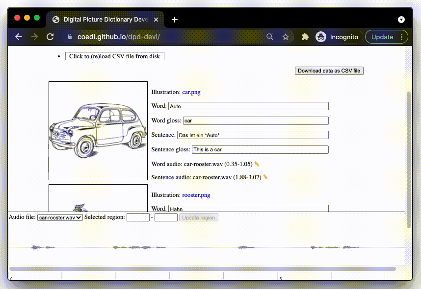

# Digital Picture Dictionary Development Interface

This repository contains a tool to quickly view picture dictionary texts and assets (images and audio) together based on a CSV file which contains the texts and links to the assets.

## View

## Update illustration

You can also quickly update the links to the assets:

## Update audio

# Usage

## Sample data

Included in this repository is sample data (see the `sample-data` directory) or download [sample-data.zip](https://coedl.github.io/dpd-devi/docs/sample-data.zip). The sample data consists of a CSV file `sample-pd.csv` and two directories which contain image and audio assets, `illustrations` and `audio`.
Included illustrations retrieved from [Open Clipart Vectors](https://pixabay.com/users/openclipart-vectors-30363/).

## Interface URL

To view the interface, visit: [https://coedl.github.io/dpd-devi/](https://coedl.github.io/dpd-devi/)

### Select audio and illustrations

Browse to where you downloaded and unzipped `sample-data.zip` (or where your own files are) and use Ctrl/Cmd + A to select all the images or audio within a given folder. These data are not uploaded to the server, only made available for viewing within the browser.

### Select data file

Browse to where you downloaded and unzipped `sample-data.zip` (or where your own files are) and select the relevant CSV file that contains text and links to the text and assets. The CSV file should have this format:

| illustration | word | word_gloss | sentence           | sentence_gloss    | word_audio_file | word_start_sec | word_end_sec | sentence_audio_file | sentence_start_sec | sentence_end_sec | 
|--------------|------|------------|--------------------|-------------------|-----------------|----------------|--------------|---------------------|--------------------|------------------| 
| car.png      | Auto | car        | Das ist ein *Auto* | This is a car     | car-rooster.wav | 0.35           | 1.05         | car-rooster.wav     | 1.88               | 3.07             | 
| rooster.png  | Hahn | rooster    | Das ist ein *Hahn* | This is a rooster | car-rooster.wav | 3.96           | 4.82         | car-rooster.wav     | 5.5                | 6.64             | 

